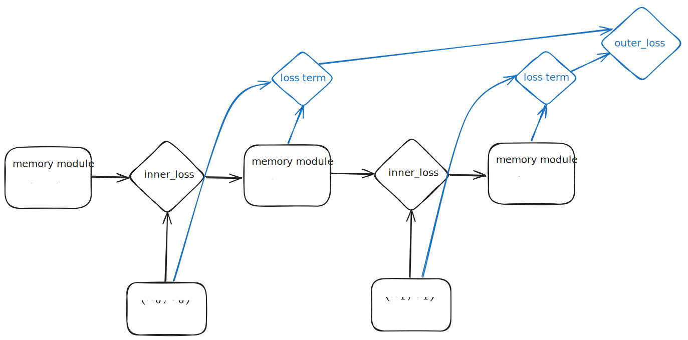

This is a PyTorch-based sandbox for in-context recall and meta-optimization experiments. For a background discussion on this topic, see [this](https://stephan271c.github.io/blog/2025/Test-Time-Regression/) blog post.

## Requirements
- Python 3.10+ (system Python or pyenv)
- git
- Optional: [`uv`](https://github.com/astral-sh/uv) for fast, reproducible installs (a `uv.lock` is included)

## Quick start (recommended: uv)
1. Install `uv` if you do not already have it (`pip install uv` or follow the uv docs).
2. From the project root, create the virtual environment and install locked dependencies:
   ```bash
   uv venv
   source .venv/bin/activate  # on Windows: .venv\Scripts\activate
   uv sync                     # add --group dev to include lint/test tools
   ```
3. Verify the environment with pytest:
   ```bash
   uv run pytest
   ```

## Alternative install (Python + pip)
1. Create and activate a virtual environment:
   ```bash
   python -m venv .venv
   source .venv/bin/activate  # on Windows: .venv\Scripts\activate
   python -m pip install --upgrade pip
   ```
2. Install runtime dependencies:
   ```bash
   pip install \
     ipykernel~=7.1.0 \
     matplotlib~=3.10.7 \
     torch~=2.9.1
   ```
3. (Optional) Install developer tooling:
   ```bash
   pip install \
     autoflake>=2.3.1 \
     black>=25.11.0 \
     flake8>=7.3.0 \
     isort>=7.0.0 \
     mypy>=1.18.2
   ```

## Running code
- Activate the environment, then open the notebooks in `src/`.
- Use `python -m pytest` (or `uv run pytest`) from the project root to run the existing tests in `tests/`.

## Overview
With alternative architectures to transformers, a natural question to ask is how well they perform associative recall; that is, for an input pair of vectors $k_i,v_i$, can the model produce $v_i$ given $k_i$? Although there are several associative recall benchmarks, they train not only the model but also the embedding and unembedding matrices, tying the architecture to a particular set of vectors. Instead, we sample vectors from the unit sphere.

The evolution of many linear RNNs can be expressed as solving an online problem, where the state matrix evolves through an optimizer step on an inner loss function. So $M_t=M_{t-1}-\text{optim}(L(M_{t-1},(k_t,v_t)))$. In comparison, a typical RNN evolves as $M_t=f(M_{t-1}, k_t;\theta)$ where $\theta$ are learnable parameters via BPTT.

In `model_components.py` we have a `TTT` class which evolves its parameters through optimization. We calculate inner gradients explicitly in the forward pass, which is encapsulated in `inner_optimization_forward` in `forward_loop.py`. At the same time, certain hyperparameters (such as inner learning rate or initial parameters) are learnable through BPTT across the sequence.



In `linear_RNN.py` we manually define linear RNNs with state update equations, in cases where the update cannot easily be defined as an optimization step. 

## Limitations
A memory module where we can choose the inner loss and inner optimizer gives us a lot of flexibility, but it's not efficient for building and training a model. Instead, after finding a suitable configuration, we should encode that state update equation.

Another issue is that the key value pairs are sampled from the unit sphere. Language models learn their own embedding and unembedding matrices, as well as projection matrices, so they can potentially find a subspace where it's easier to do associative recall.